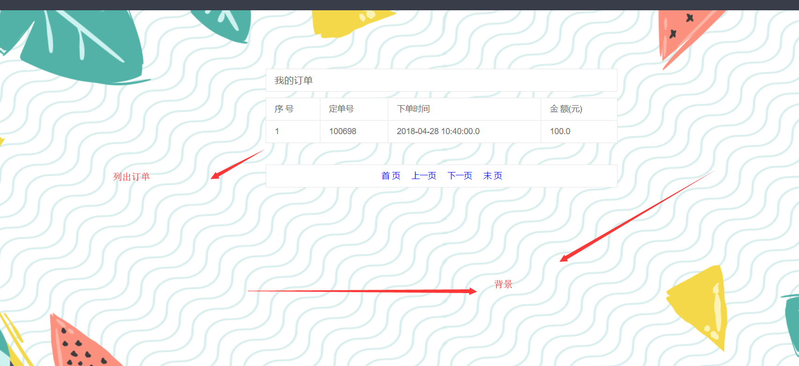

# 项目名称 #
电影购票系统
# 项目简介 #
这是一个Java Web项目

## 项目实现的主要业务功能 ##
1. 用户模块：实时订票、查看订单、账户充值、修改个人信息、猜你喜欢等
2. 管理员模块：票项管理、用户管理、订单管理。

## 项目使用的主要技术 ##
1. 使用标准的Model2架构和Spring+SpringMVC+MyBatis框架
2. 使用了DataSource连接池技术
3. 使用AJAX技术增强用户体验
4. 使用Filter实现认证控制
5. 使用HIVE技术开发根据用户的已购票项而生成的猜你喜欢电影项的推荐
# 环境配置 #
1. 安装JDK和Tomcat
2. 配置环境变量
3. 下载Myeclipse编译器
4. 下载Mysql数据库
5. 建立数据库，将数据库脚本ebp.sql导入进来
6. 将项目导入到Myeclipse中，运行

# 项目展示 #
## 用户模块 ##
查看订单

文件上传

修改个人信息

用户登录

账户充值

## 管理员模块 ##

管理员登录

首页

票项管理——查询票项

票项管理——添加新票项

票项管理——修改票项

用户管理——根据日期查询用户

用户管理——根据姓名查询用户

订单管理——根据日期查询订单

订单管理——根据订单号/姓名/用户名/身份证号 查询订单

# 作者 #
段风志

